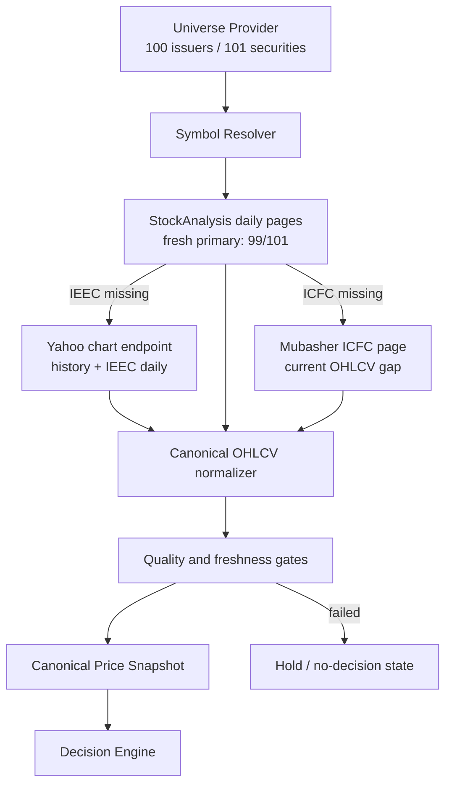

# EGX price data feasibility — adversarial investigation

Date: 2026-07-26 (Africa/Cairo)

## Executive verdict

The answer depends on the criterion:

- **Technical/free criterion: A — feasible with a three-source fallback.** Yahoo returned historical OHLCV for 91/101 securities and StockAnalysis exposed embedded history for 99/101. Their union retrieves history for **101/101 securities, representing 100/100 companies**. For the latest verified completed session (2026-07-22), StockAnalysis covers 99, Yahoo covers `IEEC`, and Mubasher supplies the current displayed OHLCV fields for `ICFC`.
- **Free/licensed/production-safe criterion: B — not proven.** Neither interface grants AGX a stable programmatic storage/model-ingestion license. The technically complete route may be blocked or changed without notice.

This investigation did not implement a collector. It produced audit probes that retain only availability/schema/count/date-bound evidence, never third-party price rows.

## Universe accounting: why 100 and 101 are both correct

The canonical files contain 31 EGX30 security rows and 70 EGX70 security rows, with no repeated ticker: 101 securities. They represent 100 issuers because Valmore Holding has two securities/share classes, `VLMR` and `VLMRA`.

The acquisition layer must therefore report both measures:

| Measure | Count |
|---|---:|
| Companies / issuers | 100 |
| Securities / ticker rows to retrieve | 101 |
| EGX30 security rows | 31 |
| EGX70 security rows | 70 |

Dropping either Valmore ticker merely to force the ticker count to 100 would create a silent coverage defect.

## Live technical evidence

### Yahoo primary

Endpoint tested:

`https://query1.finance.yahoo.com/v8/finance/chart/{ticker}.CA?range=max&interval=1d&events=div%2Csplits`

- Requested: 101
- Supported with at least one complete Open/High/Low/Close/Volume row: 91
- Coverage: 90.10%
- Priority sample supported: 10/10 (`ABUK`, `COMI`, `TMGH`, `HRHO`, `ETEL`, `EAST`, `SWDY`, `EFIH`, `MFPC`, `ORWE`)
- Missing: `VLMR`, `VLMRA`, `ACTF`, `KRDI`, `AIDC`, `AIHC`, `GPIM`, `TANM`, `TAQA`, `VALU`
- Returned fields include OHLCV, adjusted close, dividend events and split events where Yahoo has them.
- Freshness is uneven: 75 of the 91 responses stopped at 2026-06-30, 15 stopped at 2026-07-19, and only `IEEC` included the current 2026-07-26 session. Yahoo is therefore useful for history, but it is not the daily-fresh primary.

The probe artifact records HTTP status, row counts, first/last dates, field presence and event counts for every security. It stores no bars.

### StockAnalysis fallback

Paths tested for every security:

1. `https://stockanalysis.com/quote/egx/{ticker}/history/`
2. `https://stockanalysis.com/quote/egx/{ticker}.CA/history/` when the first path failed

- Requested: 101
- Pages with an embedded dated OHLCV schema: 99
- Coverage: 98.02%
- Missing: `IEEC`, `ICFC`
- `ACTF` is an important resolver case: the bare path is 404, but `ACTF.CA` returns daily OHLCV.
- Page metadata identifies S&P Global Market Intelligence as the source and says history is updated daily and adjusted for splits.

The public page exposes a limited/paginated history window. Therefore the test proves a live daily fallback and historical rows, not unlimited historical depth for every security.

### Historical union proof

Yahoo misses ten securities; StockAnalysis supports all ten. StockAnalysis misses two securities; Yahoo supports both. Therefore:

`Yahoo(91) ∪ StockAnalysis(99) = 101/101 securities = 100/100 issuers`

This is technical historical reachability and field coverage, not a promise that either site will remain stable.

### Daily freshness closure

The last completed session verified consistently across the broad fallback was 2026-07-22:

- StockAnalysis: 99 securities with embedded OHLCV dated 2026-07-22.
- Yahoo: `IEEC` contains a 2026-07-22 bar (and subsequent current-session rows).
- Mubasher: the `ICFC` stock page was indexed with last update 2026-07-22 and displays open, high, low, close/current price, and volume.

This closes current displayed data at 101/101, but the Mubasher leg is not yet a verified stable machine-readable endpoint. That is an operational weakness, not a coverage claim to hide.

## Recommended technical acquisition architecture



Required runtime behavior if this is later implemented:

1. Read all securities only from Universe Provider; do not introduce a separate price ticker list.
2. Resolve both bare and `.CA` forms per provider and maintain explicit rename/share-class aliases by ISIN.
3. Use Yahoo for backfill/deeper history where its freshness gate passes; do not mistake a 200 response for a current series.
4. Use StockAnalysis as the daily-fresh source for its 99 covered securities and as historical fallback for Yahoo's ten misses.
5. Use Yahoo for `IEEC`; use Mubasher's current session fields for `ICFC` until a stable history endpoint or licensed feed is available.
6. Normalize `date, open, high, low, close, adjusted_close, volume, dividends, splits, source, fetched_at`.
7. Reject bars with impossible OHLC relationships, negative volume, duplicate sessions, future dates, or stale latest sessions.
8. Stitch renamed symbols only with an explicit ISIN/corporate-action mapping. Never concatenate series based on company name alone.
9. Publish price readiness per security. The decision engine must emit no decision when freshness or minimum-history requirements fail.

## What is still not proven by 101/101

The weak point is historical continuity, not today's symbol coverage:

- New listings have genuinely short histories.
- Renames and share-class changes can split history across old and new symbols. Valmore already demonstrates this risk.
- Yahoo adjustments and StockAnalysis split-adjustment are not the same corporate-action contract.
- StockAnalysis's initial page is limited/paginated, so a model needing several years cannot assume the first response is sufficient.
- A 200 response with rows does not prove correct currency, uninterrupted sessions, or absence of stale data; quality gates remain mandatory.

Accordingly, the truthful status is **complete historical retrieval coverage; complete current displayed coverage through a fragile three-source fallback; variable historical depth; and incomplete operational durability**.

## Adversarial findings across all candidates

Twenty-eight candidates were assessed in the machine-readable matrix. The decisive outcomes were:

- Twelve Data matched 101/101 by ISIN in live XCAI metadata, but XCAI starts on a paid plan.
- EGID is the exchange-owned, sole authorized EGX market-data provider and offers a licensed feed, with no public free offer.
- EODHD exposed 99/101 in its public EGX catalogue, but EGX is paid and two current securities were absent.
- Tiingo and Polygon/Massive had 0/101 under their official product catalogues.
- MarketStack's public catalogue exposed no retrievable XCAI EOD records; apparent matches were non-EGX collisions or records without EOD.
- EGXAPI.com was disproved as a real provider: its documented endpoints returned 404, advertised SDK packages were absent, authentication was unavailable, and its legal center says the content is a design placeholder.
- Kaggle and GitHub snapshots are partial and stale; the strongest Kaggle snapshot covered 80/101 and explicitly originated from Yahoo/yfinance.
- Official EGX pages remain authoritative for the universe and disclosures, but no complete public machine-readable historical OHLCV feed was verified.

Primary evidence includes [EGID's market-data statement](https://www.egidegypt.com/), [Twelve Data's exchange coverage](https://twelvedata.com/exchanges), [StockAnalysis's API/licensing FAQ](https://stockanalysis.com/help/faq/api-access/), [TradingView policies](https://www.tradingview.com/policies/), [Yahoo terms](https://legal.yahoo.com/xw/en/yahoo/terms/otos/index.html), and [EGXAPI's placeholder legal center](https://egxapi.com/legal/).

## Deliverables and reproduction

- `coverage_report.json`: per-source and per-ticker `supported`, `missing`, and `reason`, plus the 100-company/101-security accounting.
- `price_source_matrix.json`: all required comparison columns for 28 sources.
- `yahoo_live_probe.json`: 101 live Yahoo results with row/schema/date evidence, no prices.
- `stockanalysis_live_probe.json`: 101 live page/schema results, no prices.

Rebuild deterministic reports:

```powershell
python research/scripts/build_price_feasibility_evidence.py
```

Refresh the two live technical probes:

```powershell
node research/scripts/probe_yahoo_coverage.mjs
node research/scripts/probe_stockanalysis_coverage.mjs
```

The live probes intentionally remain separate from the production pipeline. The original mission asked for evidence and strategy, not collector implementation.
